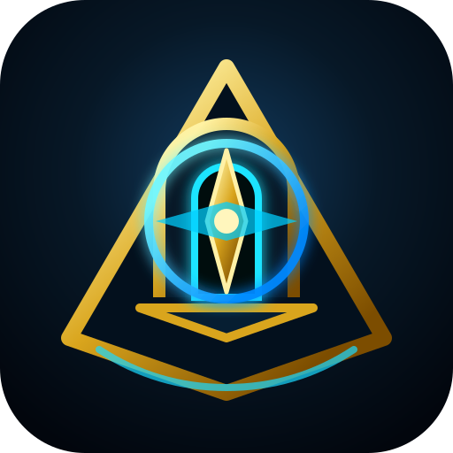

# Delver Call Tracker



**Delver Call Tracker** is a compact World of Warcraft: Midnight addon that helps you follow the **Delver's Call** questline without wasting time checking the quest log, looking for delve entrances, or remembering where to turn quests in.

## What It Does

- Tracks all 10 **Delver's Call - Midnight** quests.
- Splits progress into clear filters: not taken, in progress, completed, and turned in.
- Creates direct waypoints with TomTom or the native game waypoint system.
- Includes practical routes between Silvermoon, Isle of Quel'Danas, Harandar, and Voidstorm.
- Marks delve entrances and known turn-in locations.
- Remembers the active filter, highlighted row, and current route after reload.
- Can hide in combat, use mouseover autohide, and stay hidden automatically on level 90 characters.

## Quick Flow

Open the panel, choose a filter, click a quest, and the addon marks your next destination. If you have already finished the progression on a level 90 character, the panel will not reopen automatically after reload/relog unless you disable that option.

## Commands

| Command | Action |
| --- | --- |
| `/dcall` | Open or toggle the tracker |
| `/dct` | Short tracker alias |
| `/delverscall` | Long tracker alias |
| `/delvercalltracker` | Full tracker alias |
| `/dcall settings` | Open addon settings |
| `/dcall show` | Show the panel |
| `/dcall hide` | Hide the panel |
| `/dcall toggle` | Toggle the panel |
| `/dcall combat enable\|disable` | Enable or disable hide in combat |
| `/dcall autohide enable\|disable` | Enable or disable mouseover autohide |

## Options

- **Language:** automatic based on the client, English, or Spanish.
- **Hide in combat:** hides the tracker while you are in combat.
- **Autohide:** only shows the tracker while your mouse is over it.
- **Hide at level 90:** enabled by default. If your character is level 90 or higher, the panel stays hidden automatically after the next reload/relog. You can still open it manually at any time.
- **Appearance:** font size, width, row height, scale, and status colors.

## Installation

1. Download or clone this repository.
2. Place the `DelverCallTracker` folder in `World of Warcraft/_retail_/Interface/AddOns/`.
3. Restart the game or run `/reload`.
4. Use `/dcall` to open the tracker.

## Recommended

- **TomTom** is optional, but recommended for a better arrow and waypoint experience.
- Start using the addon around level **87** to keep Delver's Call progression aligned through level **90**.
- If you do not use TomTom, the addon tries to create waypoints with Retail's native tools.

## Project Structure

```text
DelverCallTracker/
├── Assets/
├── Core/
├── DelverCallTracker.toc
├── CHANGELOG.md
├── LICENSE
├── README.md
└── README_CURSEFORGE.md
```

## Contributions

Bug reports, feature requests, and pull requests are welcome through GitHub issues and PRs.

## License

MIT License. Copyright (c) 2026 Eduardo Lynch Araya.

## Credits

Created by **Eduardo Lynch Araya**. UI style inspired by **Myu's Knowledge Points Tracker**.
